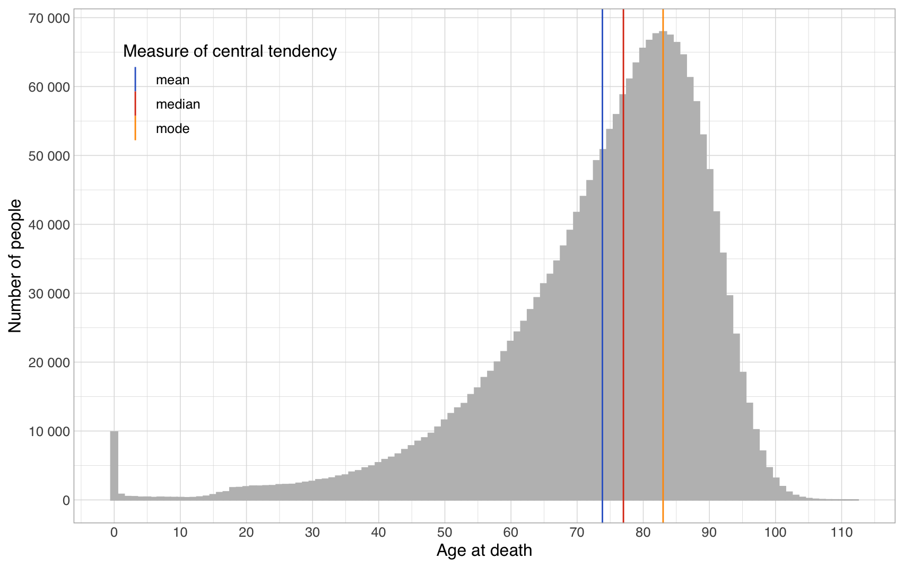
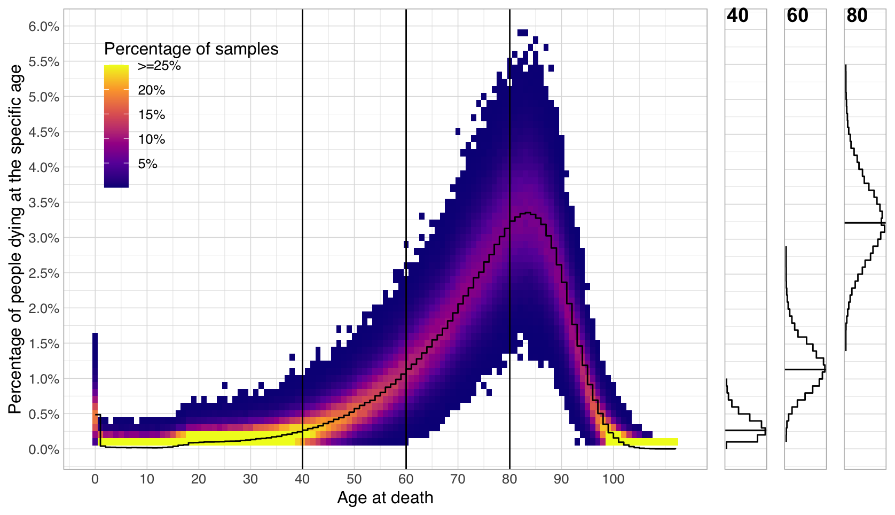
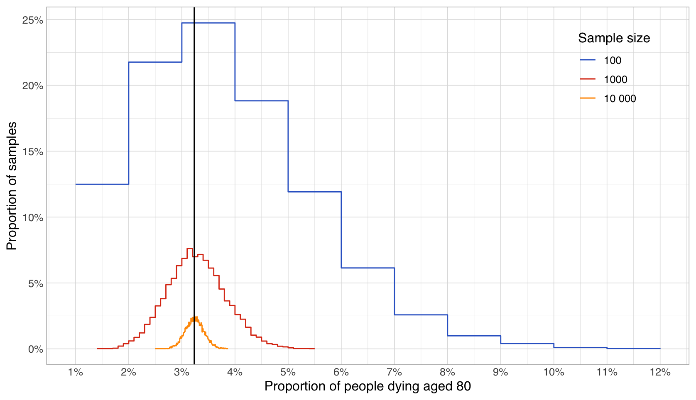
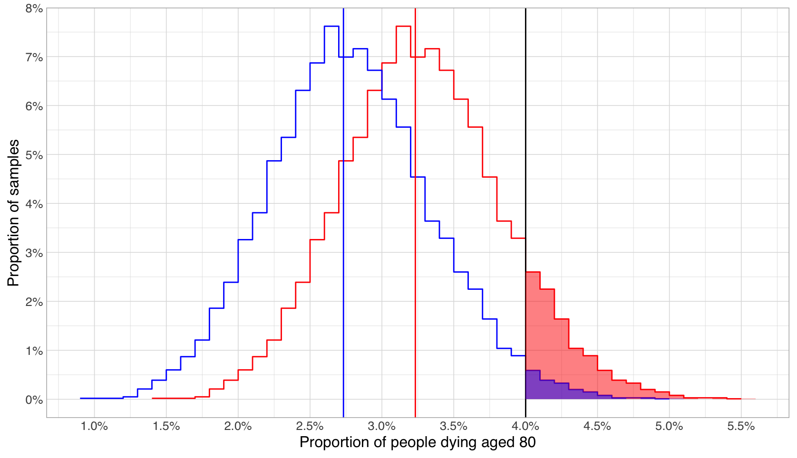
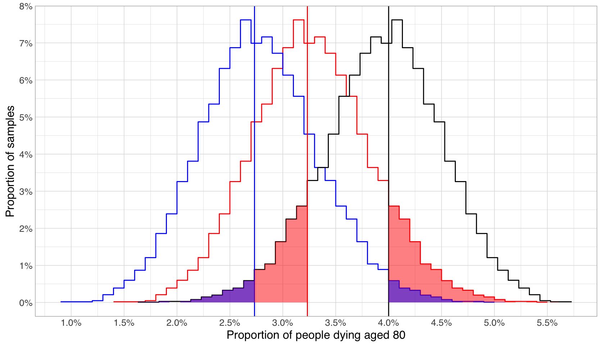
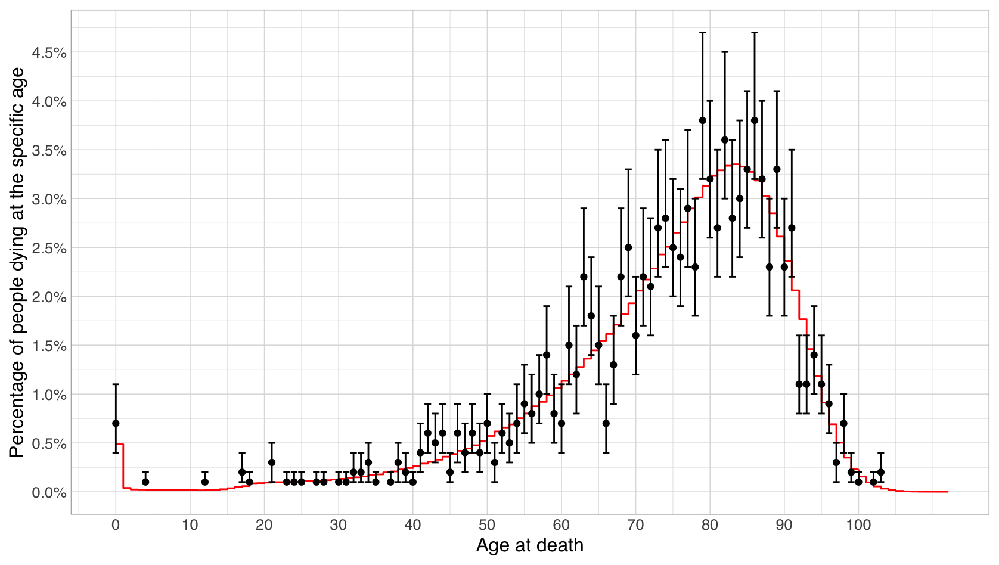

# Uncertainty in describing groups


Context note: this is a sub-part of the [fundamental concepts of statistics](./) section of the [computational literacy for humanities and social sciences course](../). You can use this to teach yourself some fundamental concepts of statistics. However, if you want to understand more broadly when you might want to use them, you're better off going through the whole course.


In [this dataset](https://pxnet2.stat.fi/PXWeb/pxweb/en/StatFin/StatFin\_\_vrm\_\_kuol/statfin\_kuol\_pxt\_12ag.px/) of the age at death of the two million Finns (2 027 385 to be exact) who died between 1980 to 2020, we have a (near-)perfect record. Almost every single person who died during that timespan is listed in the dataset, and visible in the distribution below:

This means that whatever inferences we derive from this distribution are accurate. For example, over half of Finns really lived at least 77 years.

## Populations and samples

However, very often we do not have complete data on the _**population**_ we are interested in. For example, we do not have exact data on the height of every single Finnish person, and neither do we have complete age at death data for, for example, 15th and 18th-century people. In these situations, we may however have access to a smaller _**sample**_ of such data. If the sample is _**representative**_ of the population, its distribution will have the same general shape as the population, and we can use the sample as a proxy for the population in trying to describe it.

Turned around, in practice very often when we want to apply statistics to a domain, we start by trying to gather a sample set of values describing the thing we're interested in. To not make wrong inferences, we need to try our utmost to make the composition of this sample match the population. For example, if we wanted a 1000 person sample representing the heights of adult Finns, we could use external information we have that 50.68% of Finns are women to make the sample contain 507 women and 493 men. We might also want to sample for example people from different parts of the country in their true proportions, as well as sample from different social classes. After coming up with the sample, we'd then measure these 1000 people, and use the information derived from them to infer knowledge about Finns in general.

For historical data, what survives to us as a whole may be fixed and already _**biased**_, but we could still subsample within it to correct for these biases. At the other end, if we in principle have access to anyone in the whole population, we can just take a completely _**random sample**_ of 1000 people, and trust that it will be representative of the population. This is what is attempted in most contemporary register and survey studies, but even they have to correct for e.g. non-response bias that usually clusters around particular groups of people.


Assignment

Consider [this statement](http://www.natcorp.ox.ac.uk/corpus/index.xml) on the [British National Corpus](http://www.natcorp.ox.ac.uk/): “The British National Corpus (BNC) is a 100 million word collection of _**samples**_ of written and spoken language from a wide range of sources, _**designed to represent**_ a wide cross-section of British English, both spoken and written, from the late twentieth century.” (emphases added).&#x20;

Now, consider that the composition of the BNC is subdivided as follows:

* 90% written, 10% speech
* Written:&#x20;
  * 70-80% informative, 20-30% imaginative
  * 60% books, 30% periodicals, 10% miscellaneous
  * Informative: 5% natural and pure science, 5% applied science, 15% social and community, 15% world and current affairs, 10% commerce and finance, 10% arts, 5% belief and thought, 10% leisure
  * High, low and middle-level language
* Spoken: a demographic sample of discussions and an event-based sample of educational, business, public/institutional and leisure speech (60% dialogue, 40% monologue)

Ponder and add to the discussion on in a thread on Slack:&#x20;

* Would you consider the BNC a representative sample of British English?&#x20;
  * If yes, with what reservations?&#x20;
  * If no, what would you consider it a representative sample of?&#x20;
* Can there even be a representative sample of a language as a whole?


## Without access to the complete data, uncertainty caused by randomness will always remain in a sample

Even if proper sampling practices have been followed, there is still no guarantee that the shape of a sample will exactly match the shape of the population. Instead, due to unavoidable, completely random effects in who we happen to pick and not pick, its shape can be different. Fortunately, in this situation, we can often estimate how much different it is likely to be.&#x20;

To dig into this, here are two different 1000 person samples taken from the age at death data, overlaid with the actual distribution (note that we've here moved from counting actual people to counting percentages. This way we can directly compare our smaller samples against the much larger population):&#x20;

.png>)

In the visualization, the blue and red samples are overlaid on top of each other, showing as purplish red when they overlap and either blue or light red in the parts they don't. Note how, as compared to the true distribution (black line), both samples are very ragged, meaning that for almost all ages at death, the samples either overestimate or underestimate the proportion of people dying at that age, and that this error goes randomly in either direction. Further, at each age, one sample may well overestimate and another underestimate (e.g. around 85-90 years). Finally, it is important to note that sometimes the under/overestimation can be really large (such as here for dying at 80 years, particularly for the red sample), but in general, the samples are not too far off.&#x20;

### Understanding how sample errors are distributed

In fact, from either statistical theory or through simulations, we can get a very good idea of the _**expected distribution of sample errors**_. Below, I've repeated an experiment 10 0000 times where I've randomly sampled 1000 people from the whole 2 million person dataset (population), and calculated the proportion of people dying at each age for each of the 10 000 samples.

On the left of the plot that follows, this information is presented as a heatmap. For each age, the heatmap shows in yellow the region in which most of the proportion estimates in the 10 0000 samples fell, while the more blue the region is, the fewer times a sample estimated that proportion. In the areas with no colour at all, none of the 10 000 samples gave an estimated proportion in that region.

To further aid in understanding how far and in what way the estimates derived from samples deviate from the true proportions, on the right-hand side are density plots of the sample error distributions for three different ages at death: 40, 60 and 80.&#x20;

As you can see from the plots, the errors are usually normally distributed around the true value! (except here for the error at age 40, where the other half of the distribution is cut short at 0, as one cannot die before one is born). This arises from the [central limit theorem](https://en.wikipedia.org/wiki/Central\_limit\_theorem), and holds for most situations where one is counting proportions, even in cases where the original distribution is not normal at all.&#x20;

The variance (breadth) of the sample error distribution depends on the underlying distribution it is modelling, but also the size of the sample. The larger the sample, the closer the values measured from it are expected to match the true values. For example, below are charted the error distributions at age at death 80 for three sample sizes: 100, 1000 and 10 000 people:&#x20;

The real, true proportion of people dying aged 80 is 3.2%. For a sample size of 10 000 (the yellow line), only 10% of random samples will estimate this to be either more than 3.5% or less than 2.9% (i.e. more than 3 tenths of a percentage point off from the true value). For a sample size of 1000 on the other hand, a full 65% of the sample estimates will be more than 3 tenths of a percentage point off from the true value. Instead, for this sample size, the interval into which 90% of sample estimates will fall is about one percentage point in either direction, i.e. somewhere between 2-4%.

### Estimating confidence intervals from samples

Okay, now we know how values calculated from samples deviate from the true value in general. But how does this help us work our way backwards to estimate the true value if we only have a sample? For this, we must reframe the question as "Looking at possible true values, how likely would it be that I'd end up measuring what I measured from my sample". For example, if we had measured in a sample the proportion of people dying aged 80 to be 4%, we could evaluate that result against the probability of seeing such a measurement for different possible true values and variances. For example, consider the two possible true values (2.7% and 3.2%) and their (identical) sampling error distributions plotted in blue and red below:

From the size of the shaded areas in the figure above, we can see that to get a measure of at least 4% would be much rarer if the true value was 2.7% (this would happen in only 2% of samples), as compared to if it were 3.2% (where this would happen in 10% of samples). Working backwards from this, turns out that if we just flip the sampling error distribution and centre it on our sample estimate (the blue line below), and then measure the mass farther than our possible true values, we come to the same numbers.&#x20;

So, now we have a distribution centred around the value from the sample, stating how unlikely it would be to measure the value we got given a particular true value. Now, with this information we are finally able to build a **confidence interval**. For example, we may state that given a proportion of 4% measured from our sample and the given sample error distribution, we are 90% confident that the true proportion of people dying aged 80 lies between 3.1% and 4.9% (90% of the mass of the error distribution resides in this interval). In this instance, the true value of 3.2% happens to lie just within this interval, but that is by no means guaranteed. What the confidence interval says is only that in 90% of samples overall, the true value would lie within this interval.

There is also one final piece of the puzzle still missing. In order to calculate the confidence interval, we still need the sample error distribution. And, we need to be able to calculate it from the sample, as that is all that we often have. One simple way to calculate an estimate of this distribution is called bootstrapping. In this, we take our sample as a proxy for the population, and repeatedly use it to derive new samples from it. In this instance, we sample with replacement, which just means we are free to pick the same data point in our original sample into our bootstrap sample multiple times.&#x20;

Putting this all together, below you can see the proportion estimates as well as bootstrapped confidence distributions calculated from a single 1000 person sample:

.png>)

If (as often and also in this case) the confidence distribution is normal, one often forgoes complex heatmaps or other plots showing the whole distribution, and instead just gives error bars for appropriate cutoff points in the error distribution:

Notice how in these images as opposed to the one where sampling error distributions were derived from the full population, the confidence intervals are centred on the sample estimates instead of the true values. Further, note how the true proportion of people dying at a certain age often falls within the "hot" area of the confidence interval, but also sometimes is far from it, such as for example for ages 63 and 66 (remember that for the second image, as we're looking at the 90% confidence interval, it should contain the true value about 9 times out of 10). Finally, note how the width of the confidence interval doesn't tell you anything about whether the estimate is accurate. For example, the confidence interval for the estimate at age 66 is relatively small, yet the estimate is far off from the actual true value. Again, the only thing we're saying here is that 90% of the time if we'd do what we did, the true value should be found somewhere in the calculated interval, and 10% of the time, it would not.


Assignment

Experiment with this [interactive visualization on confidence intervals](https://rpsychologist.com/d3/ci/) to better understand how even a 95% confidence interval based on a sample can sometimes be far off from the true value, and how the width of the confidence interval doesn't really tell us anything about the certainty of the estimate.

You may also want to take a look at [this interactive bootstrap visualization](https://www.lock5stat.com/StatKey/bootstrap\_1\_cat/bootstrap\_1\_cat.html) to see whether it helps you understand how bootstrapped error estimation distributions can be calculated.&#x20;

