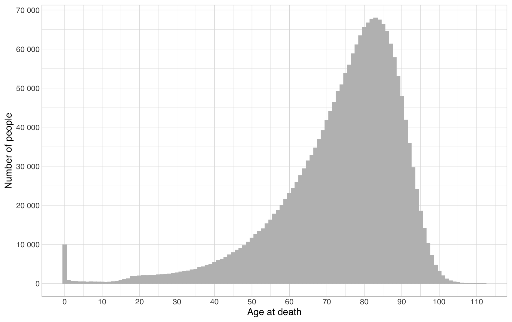

# Understanding and describing groups


Context note: this is a sub-part of the [fundamental concepts of statistics](./) section of the [computational literacy for humanities and social sciences course](../). You can use this to teach yourself some fundamental concepts of statistics. However, if you want to understand more broadly when you might want to use them, you're better off going through the whole course.


Consider [this dataset](https://pxnet2.stat.fi/PXWeb/pxweb/en/StatFin/StatFin\_\_vrm\_\_kuol/statfin\_kuol\_pxt\_12ag.px/) of the age at death of the two million Finns (2 027 385 to be exact) who died between 1980 to 2020. While aggregated in the original, the data essentially contains the following information:

<table><thead><tr><th>Sex</th><th data-type="number">Year of death</th><th data-type="number">Age at death</th></tr></thead><tbody><tr><td>Male</td><td>1980</td><td>86</td></tr><tr><td>Male</td><td>1980</td><td>76</td></tr><tr><td>Male</td><td>1980</td><td>76</td></tr><tr><td>Female</td><td>1980</td><td>75</td></tr><tr><td>Male</td><td>1981</td><td>96</td></tr><tr><td>... (for a longer sample of 1000 people, see <a href="https://docs.google.com/spreadsheets/d/1xd1HJCJdOthA8PN97Xcr0yu_NFCy6iDVjn8vuAOLALk/edit?usp=sharing">here</a>)</td><td>null</td><td>null</td></tr></tbody></table>

As a table, this tells us information about each individual. Further, we might order the two million rows by for example Age at death to find out the longest-living people for this time period:

<table><thead><tr><th>Sex</th><th data-type="number">Year of death</th><th data-type="number">Age at death</th></tr></thead><tbody><tr><td>Female</td><td>2000</td><td>112</td></tr><tr><td>Female</td><td>2005</td><td>111</td></tr><tr><td>Male</td><td>2009</td><td>111</td></tr><tr><td>Female</td><td>2015</td><td>111</td></tr><tr><td>...</td><td>null</td><td>null</td></tr></tbody></table>

However, what if we want to look at the data as a whole, to see what it tells us about the lifespans of Finns as a whole? For this, we need to turn to statistics. Let us start with a simple visualization that just takes all two million people and plots their ages at death in increasing order:&#x20;

.png>)

While this is not the way these types of data are usually presented, what does this visualization tell us? First, one can read proportions out of it. Because the people are ordered by age at death, looking at the midpoint of the graph (around the 1st millionth person) and looking at the age recorded there (around 77), we can say that 50% of Finns live to be older than 77. This works for any percentage: looking at around 200 000 (10% of 2 000 000) and finding the number 52, we can say that only 10% of Finns die before reaching that age, while looking at 1 800 000, we can conclude that only 10% of Finns live longer than 90 years.&#x20;

This works the other way around as well. For example, looking at age 40 and finding the number 100 000 (5% of 2 000 000), we can say that only 5% of Finns die before reaching 40. If we want to know the proportion of Finns who die between 40 and 80, we look up 80 (at about 1 200 000 or 60% of 2 000 000) and can calculate that 60%-5%(the proportion from 0 to 40)=55 per cent of Finns die in that time period.&#x20;

To make these calculations easier, we can replace the person number with their position in percentage of the dataset. Further, let's switch the X and Y axes with each other. In this format, the ensuing graph has a term associated with it: the empirical cumulative distribution function.

.png>)

So, only 5% of Finns die within the first 40 years of their lives, while 55% die in their next 40. Projecting this information back into the graphs, we can see that in the first graph arranged by people, in the horizontal bands where the graph moves up quickly, there are few people. In the bands where it moves up slowly, there are many more people. In the graph arranged by age at death on the other hand this is reversed. Where the graph moves up slowly, there are few people, and where it moves quick, there are many.&#x20;

While these graphs are good for dividing the data into percentages, from them it is still difficult to get a good idea of when exactly people are likely to die. To get a better overview of this, we need to move from cumulative graphs to ones showing local density. For this, we need to calculate the distribution of the data over the Age at death. What this means is that we take each Age at death, and count how many people die at that age. The resulting table looks like this:

<table><thead><tr><th>Age at death</th><th data-type="number">Number of peoplle</th></tr></thead><tbody><tr><td>112</td><td>1</td></tr><tr><td>111</td><td>3</td></tr><tr><td>110</td><td>6</td></tr><tr><td>109</td><td>10</td></tr><tr><td>...</td><td>null</td></tr></tbody></table>

Plotted visually, this table looks as follows:

Here, the height of each bar corresponds directly to the number of people dying at that age. This allows immediate look up and comparison of exact ages (e.g. that about 10 000 people died aged 50, while about double that many people died aged 60). Comparing ranges on the other hand now requires comparing the geometric area of the different regions in the graph. This is not something that humans are good at doing accurately, but general notions are still available.&#x20;

For example, from this visualization we can immediately see the following things:

1. Many people die in the first year of their lives
2. After that, there is only a small chance of dying before reaching 30, which seems to be very low between 1-15 and then increase somewhat in the late teen years.
3. After 30, the probability of death slowly increases. The average age at death by natural causes seems to be somewhere around 80 years, but there is a large variation of 10-20 years around that as well.

This last observation takes us to a side path on [summary statistics](what-is-average.md).
