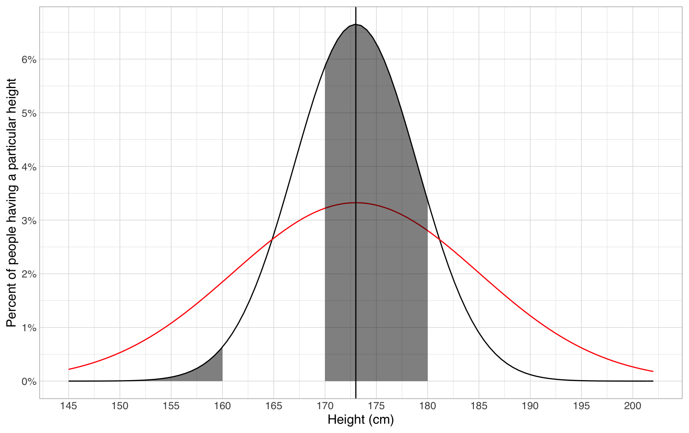
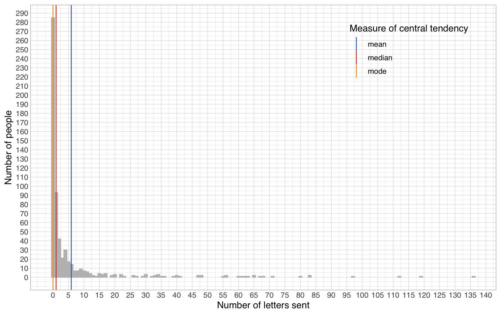

# What is average?


Context note: this is a sub-part of the [fundamental concepts of statistics](./) section of the [computational literacy for humanities and social sciences course](../). You can use this to teach yourself some fundamental concepts of statistics. However, if you want to understand more broadly when you might want to use them, you're better off going through the whole course.



Assignment

Before reading on, consider for a moment what you could infer if you were told that the average height for adult Finns is 173 centimetres? Really - stop for a moment and think what could you intuitively infer from this information before proceeding.


Perhaps you inferred that about half of Finns would be over 173cm tall and half under, and that 173cm would itself be the most common height? You'll also have inbuilt ideation of the variation - that there will probably be quite many people between 160cm and 180cm in height, but much fewer people shorter than 150cm or taller than 190cm. All of these ideations depend on the fact that [height is normally distributed](https://ourworldindata.org/human-height#height-is-normally-distributed), i.e. the distribution of heights looks something like this:&#x20;

With such data, summing it up in terms of an average value and the breadth of variation around it tells us everything we need to know about the data, and yields our intuitive understanding of what it means in practice if someone says that the average height for adult Finns is 173 centimetres.&#x20;

Note that even when not often explicitly given, at least a latent understanding of the breadth of variation is still crucial to be able to fully understand an average. For example, currently we're more than ten times likely to meet a person who is about 170-180cm in height than to meet someone who is less than 160cm. However, if there was double the amount of variation in how tall people are, we'd only be twice as likely to meet someone between 170-180cm as someone less than 160cm (compare the shaded areas in the black and red graphs below):

.png>)

### But what if data is not (completely) normally distributed?

Before, I wrote that usually, our intuition on averages is that the average is the most common value, as well as that 50% of values are larger and 50% smaller than the average. Now, remember again this data:

In relation to this graph, I wrote that the average age at death by natural causes seemed to be somewhere around 80 years. However, if I calculate the arithmetic mean for the whole data, it turns out to be 73,82 years. And remember, from already the original cumulative plot we deduced that half of the people die by age 77, while half live longer. Only by looking at which exact age most people died do we come close to 80, by getting 83 (67 943 people died aged 83). What does this all mean?

It means that **because our age at death data is not completely normally distributed**, there is no longer a single neat average that would sum it up nicely. Instead, we are left with multiple numbers that measure different things. Formally, these are called different measures of central tendency:

* The median of 77 tells us that 50% of people live at least to that age.
* The mode of 83 tells us that that is the most common age of death.
* The arithmetic mean of 73,82 tells us that if we removed all the variation and distributed lifetimes equally, each Finn would live 73,82 years.

When data is normally distributed, all of these measures point to the same number, yielding our intuition of what an average is. However, with non-normally distributed data, none of these measures anymore (even with a measure of variation added) sums up the whole truth of what goes on in the distribution. Below, you will find each of these measures overlaid on top of the original density plot:

Interpreted visually, the measures show the following:

* the mean shows the balance point of the distribution. If the distribution were a physical object to be hinged upon this point, it would stay level. For the age at death distribution, this means that because there is a large mass of deaths at zero years far away from the bulk of the distribution, the mean is less than the other measures.
* the median shows the point which divides the geometric area of the distribution in half (here showing again how hard it is for people to compare areas of different shapes)
* the mode merely shows the point(s) where the distribution is highest. Here this works out well, but the mode is volatile. For example, if the central mass of the distribution was much more spread out and the outlier at zero years was higher, that might end up being the mode of the whole distribution, even if the general shape of it stayed otherwise the same. Further, the mode here depends on the data having already been aggregated to a sensible level (years). If instead, we'd have more precise information on the ages at death (e.g. not only years, but months, days or even seconds), we'd eventually end up in a situation where every age appeared only once, and the mode would thus end up encompassing every number in the dataset. The mean and median on the other hand would continue working just fine.

For the ages at death distribution, there is actually a large normal component. For the large subgroup of approximately 85% of people who manage to reach adulthood and die of natural causes, the ages at death distribution is relatively normal.&#x20;

On the other hand, if the whole distribution modelled diverges significantly from normal, the measures of central tendency are even less usable. For example, below is plotted the distribution of the number of letters sent by a group of 16th and 18th-century people (derived from metadata of the [Corpus of Early English Correspondence](http://www.helsinki.fi/varieng/CoRD/corpora/CEEC/index.html)). The mode of the distribution is zero letters. The median is one letter, and the mean is 5.9 letters. None of these numbers is able to capture the whole shape of the distribution, where most people send no letters at all, but where there are also 19 people who each sent more than 50 letters, the most prolific having sent a whopping 136.

In the humanities, a very large proportion of the phenomena studied are not normally distributed. Therefore, relying on any of the averages to sum up the material is often problematic. Instead, one must often drag along and analyse the entire complexity of the distribution as a whole.&#x20;

In situations where summarization cannot be avoided, the median is often a good measure to utilize. First, it always has a clear and intuitive interpretation: "half of the data is below the median, half above it". Second, the formula behind the median is extensible to other percentages. For example, to better describe the above distribution, we could state that 40% of people send zero letters, 50% of people send at most 1 letter, 70% send at most 3, 80% sent at most 5 and 90% send at most 15, while the maximum number of letters sent is 136 (i.e. 100% of people send at most 136 letters).&#x20;

### An aside on boxplots

Related to this, there is a commonly used plot type that is worth understanding: the box plot. Below, you'll find box plots of the two distributions presented before.

.png>)

.png>)

In box plots, the line in the centre of the box denotes the median, while the ends of the box denote the 25% (first quartile) and 75% (third quartile) points. The whiskers before and after the box denote the minimum and maximum values of the "main mass" in the data, while all other data points are classified as "outliers" and denoted with individual dots. The usual formula for deciding when a value is an outlier or part of the main mass is to see whether it falls further than 1.5 times the inter-quartile range (the width of the box) away from the nearest quartile (box end).&#x20;

Box plots are particularly often used when comparing groups, as one can easily plot multiple boxes side by side and immediately see how the main masses of different groups relate to each other. For now, however, know also that there are other options, such as [beeswarm plots](https://github.com/eclarke/ggbeeswarm), which are equally compact, but lose even less information on the overall shape of the distribution:

.png>)


Assignment

* If the concept of mean, median and mode did not already become clear to you, [this](https://statistics.laerd.com/statistical-guides/measures-central-tendency-mean-mode-median.php) is another explanation of them that comes from a different angle, but which I think is also relatively accessible.
* After you think you've nailed down what the different measures of central tendency are and how they relate to each other, do the practice problems relating to how altering data affects the mean and median at [Khan Academy](https://www.khanacademy.org/math/statistics-probability/summarizing-quantitative-data/more-mean-median/e/effects-of-shifting-adding-removing-data-point). If you still do not yet know how to answer the questions given there, peruse the videos and tutorials linked there before the problems.
* For fun, go read the ["well-chosen average" section](https://www.horace.org/blog/wp-content/uploads/2012/05/How-to-Lie-With-Statistics-1954-Huff.pdf) of "How to lie with statistics"


