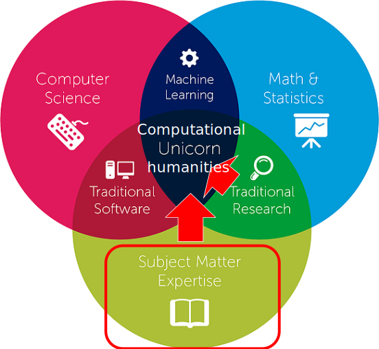

# Three approaches to computational methods

On this course, the following three approaches to computational human sciences will be covered:

## Three approaches to computational human sciences - what to learn if you're a humanist or a social scientist?

1. [Knowledge of easy to use end-user data processing and visualisation tools](../easy-tools-for-processing-and-exploring-data.md)
   * Easy to use for their intended purpose, but limited
2. [Knowledge of the fundamentals concepts of programming](../data-processing-fundamental-concepts-of-programming-for-humanists.md)
   * Frees you to process your data more efficiently
   * Allows you to more freely apply visualisations etc based on ready libraries and tutorials on the Internet
3. [A basic understanding of the fundamental concepts of statistics](../data-analysis-fundamental-concepts-of-statistics/), as well as [a high-level understanding of what types of things can be accomplished with advanced statistical and CS methods](../computational-data-analysis-method-literacy/)
   * To understand what is possible
   * To be able to read research in computational humanities
   * To be able to communicate in collaborative projects

In the following, these viewpoints will be put into both their disciplinary as well as pedagogical context, and oriented with regard to each other.

## Context: which of the different digital humanities/computational social sciences?

There is no single digital humanities, nor a single computational social science. Instead, both are often used as tactical terms:

> To assert that digital humanities is a “tactical” coinage is to insist on the reality of circumstances in which it is unabashedly deployed to get things done—“things” that might include getting a faculty line or funding a staff position, establishing a curriculum, revamping a lab, or launching a center.
>
> _— Kirschenbaum, M. (2012). Digital Humanities As/Is a Tactical Term. In M. K. Gold (Ed.), Debates in the Digital Humanities (_[_in context_](https://hyp.is/bNjpythNEeiDfqOwZfYFKg/dhdebates.gc.cuny.edu/debates/text/48)_)_

On a global level, this results in digital humanities and computational social science as fields being comprised of a complex landscape of _partially_ overlapping domains, including e.g. humanities computing, multimodal cultural heritage and digital culture studies. Crucially, while each of these subcamps has aspects in common with their neighbours, who have things in common with their neighbours, these connections do not extend uniformly across the whole landscape. Therefore, it makes sense to think about, and clearly explicate the subsets of digital humanities or computational social sciences meant in each particular context (this is really important. So, if you are not already familiar with the landscape of digital humanities and computational social sciences, see for example [this presentation](http://j.mp/allthedh), or read [this article](http://digitalhumanities.org/dhq/vol/4/1/000080/000080.html) before continuing).

On this course, the focus is on **applying modern data processing to complex social and historical data in order to yield new knowledge on phenomena of interest to scholars in the humanities and social sciences**. This definition aligns nicely with an older version of the definition of digital humanities at King's College London (replaced in 2011 with a much more [generic description](http://web.archive.org/web/20111204033346/http://www.kcl.ac.uk:80/artshums/depts/ddh/about/dh.aspx)):

> "The digital humanities comprise the study of what happens at the intersection of **computing tools** with cultural artefacts of all kinds. This study begins where basic familiarity with standard software ends. It probes how these common **tools** may be used to make new knowledge from our cultural inheritance and from the contemporary world. It equips students to analyze problems in terms of **digital methods**, choose those best for the job at hand, apply them creatively and assess the results. It teaches students to use **computing as an instrument** to investigate how we know what we know, hence to strengthen and extend our knowledge of the world past and present." (highlights added)
>
> _— Center for Computing in the Humanities. "Introduction to the Digital Humanities". King's College London._ 13 January 2006 ([in context](https://hyp.is/A3betthREeiK4hfqTp5pCg/web.archive.org/web/20060114101653/http://www.kcl.ac.uk:80/schools/humanities/cch/digihum))

What both of these definitions describe is by no means a new thing. In truth, they're just the rebranding of a much older tradition of [humanities computing](history-of-humanities-computing.md).

Now, given the above definition, what does it mean in practice? What is the best background for people engaging in such work? What should one learn, and on the other side of the coin, how should the content be taught?

## Interdisciplinary computational human sciences

In our opinion, computational studies in the humanities and social sciences (henceforth referred to by the shorthand computational human sciences) are currently best done in interdisciplinary collaboration. The reason for this is that contrary to more established statistical social science or clinical research, there are no generally applicable codebooks or protocols on how to reliably conduct even the most common types of computational research in the humanities and interpretative social sciences in a trustworthy manner. The underlying cause of this is the complexity of all of 1) phenomena, 2) datasets as well as 3) questions of interest. Because these complexities are also often specific to individual datasets and questions, each application of computation must spend significant time and understanding mapping them to the equally complex requirements, considerations and limitations of modern computational and statistical algorithms.

Due to this complexity, at present, it is very difficult for a human sciences scholar alone to apply the complex methods in a trustworthy manner (for cases in point, see the many applications of [topic modelling](../computational-data-analysis-method-literacy/digging-into-a-method-topic-modeling.md) to human science questions which do not understand the method and its limitations enough to be comfortable in actually drawing strong results from the output). At the same time, this complexity means that neither can computer scientists, statisticians or physicists solve the humanities questions alone, even if they understand the algorithms (for cases in point, see e.g [The Parable of Google Flu: Traps in Big Data Analysis](https://doi.org/10.1126/science.1248506), [A Biased Review of Biases in Twitter Studies on Political Collective Action](https://doi.org/10.3389/fphy.2016.00034) or [The Use and Abuse of the Digital Humanities in the History of Ideas: How to Study the Encyclopédie](http://www.tandfonline.com/doi/pdf/10.1080/01916599.2013.774115?needAccess=true)).

What is needed then is true interdisciplinary collaboration where statisticians, computer scientists and scholars in the human sciences all work together to develop, test and apply the methodology to solve complex human questions.

> "Deep and significant progress in social science, in other words, will require not only new data and methods but also new institutions that are designed from the ground up to foster **long-term, large-scale, multidisciplinary, multimethod, problem-oriented social science research**. To succeed, such an institution will require substantial investment, on a par with existing institutes for mind, brain, and behavior, genomics, or cancer, as well as the active cooperation of industry and government partners." (highlights added)
>
> — [Duncan J. Watts (Microsoft Research): Computational Social Science: Exciting Progress and Future Directions. The Bridge on Frontiers of Engineering, Volume 43, Issue 4](https://www.nae.edu/Publications/Bridge/106112/106118.aspx) ([in context](https://hyp.is/jOe\_SOGeEeiJrx-GonPsUw/www.nae.edu/Publications/Bridge/106112/106118.aspx))

At its best, such collaboration also has something unique to offer each of these groups _inside_ their own field of study: scholars in the human sciences are able to tackle questions too labour-intensive for manual study, computer scientists encounter new and challenging use cases for their tools and algorithms, and even the institutions providing the data gain valuable insight into, and feedback on their collections and the way they present them.

> "At Humanities + Design our mission is to **produce**, through the lens of humanistic inquiry, **new modes of thinking in design and computer science** to **serve data-driven research in the humanities**. We believe that humanistic inquiry, grounded in interpretation, has much to contribute to the development of technologies if they are to help us reveal ambiguity and paradox, allowing human-scale exploration of complex systems." (highlights added)
>
> — Mission statement of the [Humanities + Design research laboratory](http://hdlab.stanford.edu) at Stanford ([in context](https://hyp.is/Rcp0YuGdEeiZ2N\_X5uBWGQ/hdlab.stanford.edu/))

## What should be taught to human sciences students about computational human sciences, and how?

Given the above rationalisation of true computational human sciences needing to be done in interdisciplinary collaboration, what then should a student coming from the humanities or social sciences learn? This is also not a new question. Surveys canvasing computing courses aimed at people in the humanities were reported on in the "Computers and the Humanities" journal in [1971](https://doi.org/10.1007/BF02402323), [1972](http://doi.org/10.1007/BF02403762), [1974](https://doi.org/10.1007/BF02400288), [1978](http://doi.org/10.1007/BF02400087) and in a special issue wholly focusing on "teaching Computing to Humanists" in [1987](http://doi.org/10.1007/BF00517812). But more interestingly, in the same special issue, the article ["Computers and the Humanities Courses: Philosophical Based and Approach"](https://doi.org/10.1007/BF00517809) already lays out many of the principles guiding also this present course. Summarising discussions held at a workshop the previous year, the article states:

> The Vassar Workshop generated considerable debate on questions such as whether humanities students need to learn programming, whether to teach programming before or after introductory packaged programs, and the depth of knowledge required in related areas such as statistics. The arguments reflected two distinct philosophies concerning the goals of training humanities students in computing.
>
> — Nancy M. Ide: Computers and the humanities courses: Philosophical bases and approach, Computers and the Humanities, December 1987, Volume 21, Issue 4, page 209 ([in context](https://hyp.is/g63r2M0-EeiXsVNHMF\_0nQ/link.springer.com/content/pdf/10.1007%2FBF00517809.pdf))

Later in the article, these two approaches are further elaborated. Of the first philosophy, the following is said:

> The first of the two extremes may be called the "Holistic View" of computers and the humanities courses. In this view, such courses as introductions to computers and the humanities are a field of study. As such, these courses should do what any introductory course should do: provide a broad survey of the field and identify and expound the theoretical principles that inform its methodologies, in order to provide a foundation for further learning and work. Emphatically and primarily, they are not intended to provide task-specific information and skills, but instead seek to lay the foundation for a possible lifetime of humanities research activity involving computers. ([in context](https://hyp.is/\_v57\_s0-EeiXOR8kBVTlPQ/link.springer.com/content/pdf/10.1007%2FBF00517809.pdf))
>
> Substantial treatment of the methodological context and perspective _within the humanities_ is also the basis of research in which the computer can play a role. Also involved is the acquisition of computing skills, but these are taught primarily to convey an understanding of the general principles they illustrate, rather than as ends in themselves. ([in context](https://hyp.is/IWmics0\_EeiHgTfn7yhlDA/link.springer.com/content/pdf/10.1007%2FBF00517809.pdf))
>
> — Nancy M. Ide: Computers and the humanities courses: Philosophical bases and approach, Computers and the Humanities, December 1987, Volume 21, Issue 4, pages 210 & 211

The second, "Expert Users View" is described thusly:

> According to the second view of computers and the humanities courses, the extreme opposite end of my continuum, the content of such courses is primarily intended to provide students with tools and skills to do one or more jobs. ... The overall intent is to familiarize students with existing tools and provide sufficient skills to enable them to automate phases of fundamentally traditional humanities research ... to provide for immediate application of the computer to work and research in the humanities ([in context](https://hyp.is/UrLxZt3VEei0RE8UNZOHug/link.springer.com/content/pdf/10.1007%2FBF00517809.pdf))
>
> — Nancy M. Ide: Computers and the humanities courses: Philosophical bases and approach, Computers and the Humanities, December 1987, Volume 21, Issue 4, page 211

Like those present at Vassar in 1986 (_"Admittedly, most panelists and participants at the Vassar Workshop did not espouse either extreme opinion outlined above"_), this course also makes use of both viewpoints. Let us return to the three approaches mentioned at the beginning:

## Three approaches to computational human sciences - what to learn if you're a humanist or a social scientist?

1. [Knowledge of easy to use end-user data processing and visualisation tools](../easy-tools-for-processing-and-exploring-data.md)
   * Easy to use for their intended purpose, but limited
2. [Knowledge of the fundamentals concepts of programming](../data-processing-fundamental-concepts-of-programming-for-humanists.md)
   * Frees you to process your data more efficiently
   * Allows you to more freely apply visualisations etc based on ready libraries and tutorials on the Internet
3. [A basic understanding of the fundamental concepts of statistics](../data-analysis-fundamental-concepts-of-statistics/), as well as [a high-level understanding of what types of things can be accomplished with advanced statistical and CS methods](../computational-data-analysis-method-literacy/)
   * To understand what is possible
   * To be able to read research in computational humanities
   * To be able to communicate in collaborative projects

Of these, approaches one and two are things that you can do and master yourself. In learning them, you gain new immediate capabilities to do your research more efficiently. The third approach on the other hand bridges from elementary statistics which you can also do yourself toward an understanding of what is possible in the field of computational human sciences as a whole. It also means gaining enough understanding of the advanced methods to be able to read research articles using them, or to converse with the experts who develop them.

At the same time, even when going through individual tools and the fundaments of programming, this course teaches them more on a signposting level, more in the pursuit of charting a common landscape and general understanding than to provide deep instructions in any particular task. More so, it is left to the user to figure out which tools are of interest to them, and to then individually pursue further knowledge of how to become proficient in them.

Similarly, instead of focusing on particular workflows for particular types of data, examples on the course are taken from as different fields of the human sciences and as different types of data and questions as possible. Through this, it is argued that a deeper understanding of the possibilities afforded by computation can be attained.





##

## Assignments

* Answer the course background [questionnaire](https://goo.gl/forms/gQpLPyOVV4ZvtL1x1)
* Look over the [final projects from previous participants](../final-project.md#submissions-from-previous-years). Select the project that interests you the most. Post a short message on the [#introductions](https://slack.com/app\_redirect?channel=introductions\&team=T276JCMEU) channel on the course [Slack](http://meth4dh.slack.com) to introduce yourself and to describe why you chose those that project.
* Dig deeper (optional): to better understand the context of this course, read up on [the history of humanities computing](https://jiemakel.gitbook.io/meth4dh/which-of-the-digital-humanities#assignment-1) and complete the assignments given there.

