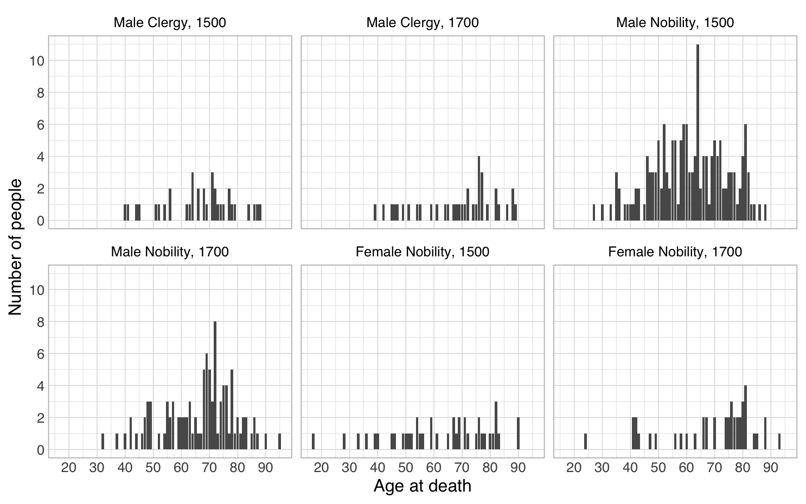
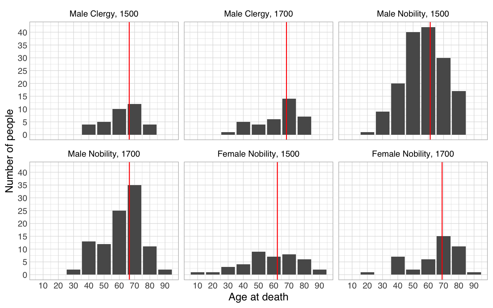
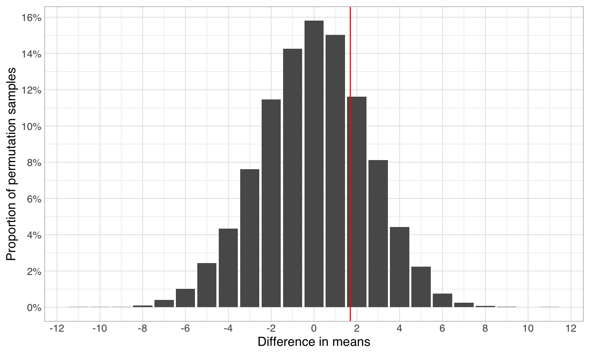
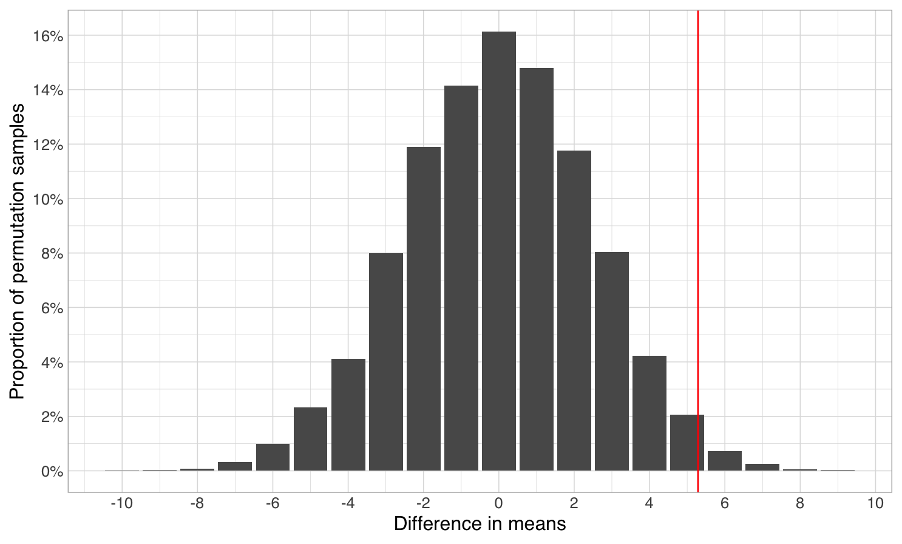
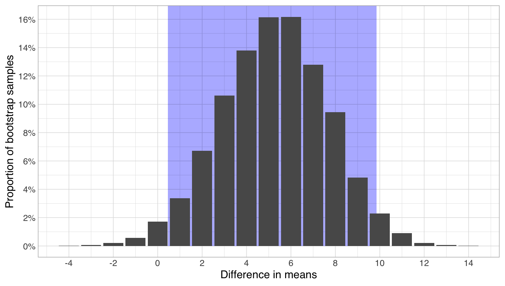

# Comparing groups

Picking up where we left off and jumping straight into analysis, from the measures of central tendency depicted above, we can calculate that female Finns seem to live quite a bit longer than male Finns, with for example 50% of females living to at least 81 years old (their median age at death), while only 25% of male Finns live that long (3rd quartile). For male Finns, the median age at death is only 73. Further, from the shape of the distribution and the quartiles (25% and 75% equivalents of the 50% median), it can be inferred that the lifespans of Finnish males vary more than those of females. Particularly the first 25% quartile for males is very much to the left of that of females, meaning that a much larger proportion of men die young.

Here, in the case of data describing complete populations, all of the above are facts. The difference in proportions of females and males surviving to 81 is 25 percentage points, and the difference between the median age at death for females and males is 8 years, while the difference in mean age at death is 8.7 years (for evaluating differences, means often work as well as medians, and they have also some benefits in how their sampling error is distributed, as well as in how calculating them makes better use of sparse data. We don't have the space to go into those details, but it is good to know that this is the case). However, strictly speaking, this still doesn't give us a definitive answer to whether females live longer than males. For that, we still need to know how unlikely it would be to see such differences just due to random chance in the situation where, in truth, for example the mean ages of death for men and women would not differ.&#x20;

## Significance testing

Restated, to really be certain that there is a difference between for example the median age of death for women and men, we need an alternate, neutral explanation for the observed difference. In this alternate explanation, the true median age of death for men and women would actually be the same, and the observed difference we are seeing would be caused purely by random variation in how long individual people live, which has just happened to cluster so that women have lived longer.

To rule out this alternative explanation (often called the null hypothesis), we will calculate how unlikely it would be that if it were true, we'd see as big a difference as we're really seeing. While there are many standard statistical formulas for calculating this, often they only work for normal distributions or have other limitations. A nice non-committal approach to this problem are permutation tests, which, similarly to bootstrap methods, rely on resampling the data we have. In essence, what we do here is put all our data into a single pool, and then randomly split the pool into "female" and "male" parts in the same proportion as in our actual data. This way, no inherent structure between the two groups remain, and instead any difference we measure between their medians is caused by pure random chance.&#x20;

Doing this for example 10 000 times, we get a distribution of the random variation. Then, we can see how large a portion of this distribution we need to include before our measured difference is included in it.&#x20;

Doing so for our complete data which is huge, we easily come to the conclusion that the difference between the median age of men and women is real. In 10 000 random shuffles of the original data, the largest mean difference that randomly appeared was 0.09 years. Extrapolating from the normally distributed errors, the chance that a difference of 8.7 would randomly appear is one to a number with 27 212 zeros (a trillion has 12 zeros).&#x20;

As an aside, such is the law of large numbers - with this data, even a difference of 0.05 years in either direction would show up as statistically significant (=unlikely to arise randomly) at the 5% cutoff often used (and stated p<0.05). On the other hand, what would a difference in mean age at death of 0.05 years mean in practice? Particularly if that was the only thing we know, and did not know whether the distributions giving rise to that mean looked otherwise different? The important takeaway from this is that a difference being statistically significant means nothing in itself, without a deeper understanding of the size of the difference, as well as what aspects the comparison (often of means) might miss completely.

While in this instance due to the size of the difference and the size of the data, testing for significance yielded a foregone conclusion, when looking at either smaller differences or smaller datasets, ensuring the difference cannot be caused by just random chance is important.

## Uncertainty in comparing groups based on samples

While significance testing is appropriate for even complete sets of data, trying to discern differences from samples adds the complexity of random variation caused by sampling errors. Thus, here one often wants to both 1) calculate a confidence interval for the quantity of interest (e.g. the difference in means), which will account for sampling variation, as well as 2) do a test for significance, which will tell whether the difference might have been caused just by chance.

To give some examples of this in practice, we will use the following historic sample of ages at death, derived from metadata of the [Corpus of Early English Correspondence](http://www.helsinki.fi/varieng/CoRD/corpora/CEEC/index.html):

Here, on the whole, we have age at death data for only 415 individuals, further unevenly distributed between groups as follows:

<table><thead><tr><th>Century</th><th>Sex</th><th>Rank</th><th data-type="number">Number of ages at death</th></tr></thead><tbody><tr><td>1500</td><td>Male</td><td>Clergy</td><td>35</td></tr><tr><td>1700</td><td>Male</td><td>Clergy</td><td>37</td></tr><tr><td>1500</td><td>Male</td><td>Nobility</td><td>159</td></tr><tr><td>1700</td><td>Male</td><td>Nobility</td><td>100</td></tr><tr><td>1500</td><td>Female</td><td>Nobility</td><td>41</td></tr><tr><td>1700</td><td>Female</td><td>Nobility</td><td>43</td></tr></tbody></table>

As can be seen from the distribution plots, this data is quite spotty. To get a slightly better overview of it, we can group the ages into decades:

Wanting to compare like with like, let us start with seeing whether male clergy or nobles lived longer in the 18th century. In our sample, 18th-century clergymen outlive 18th-century nobles on average by 1.7 years. However, conducting a permutation test for significance, we come up with the following breadth of random variation in the case where no actual difference would exist:

As can be seen from this distribution, a difference of 1.7 in either direction would not be unexpected at all. In fact, a full 50% of the differences in random samples from the unified population are either below -1.7 or above 1.7. Therefore, we must conclude that we have no evidence for clergymen living longer than nobles in the 18th century.&#x20;

However, if we do the same comparison for male nobles and clergy in the 16th century, where the difference in means is 5.29 years to the advantage of clergymen, we see the following distribution for differences in means for the null hypothesis:

Here, the observed difference of 5.29 years is so far to the right of the distribution of random differences that only 3% of the random differences are more than 5.29 years in either direction. Therefore, at the significance level of p<0.05, we can conclude that the difference isn't likely to arise just from random effects.

However, while we now know that the difference is statistically significant, we still don't know how large it is. 5.29 years is just our estimate from our sample. To get the probable range of the difference, we can construct confidence intervals for it. Through bootstrapping, we come up with the following probability distribution for the difference:

Shaded is the area where 95% of the estimates appear, which translates to a 95% confidence interval of \[0.45,9.86], meaning that we're quite certain that 16th-century mare clergy outlived their noble counterparts on average by somewhere between one half and ten years.
