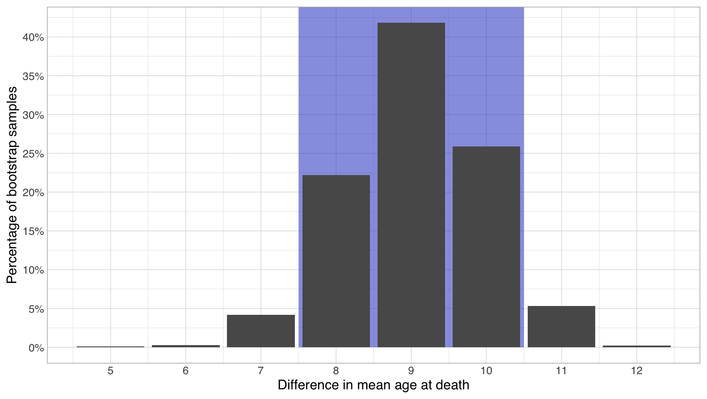

# Comparing groups

Picking up where we left off and jumping straight into analysis, from the measures of central tendency depicted above, we can calculate that female Finns seem to live quite a bit longer than male Finns, with for example 50% of females living to at least 81 years old (their median age at death), while only 25% of male Finns live that long (3rd quartile). For male Finns, the median age at death is only 73. Further, from the shape of the distribution and the quartiles (25% and 75% equivalents of the 50% median), it can be inferred that the lifespans of Finnish males vary more than those of females. Particularly the first 25% quartile for males is very much to the left of that of females, meaning that a much larger proportion of men die young.

Here, in the case of data describing complete populations, all of the above are facts. The difference in proportions of females and males surviving to 81 is 25 percentage points, and the difference between the median age for females and males is 8 years. However, strictly speaking, this still doesn't give us a definitive answer to whether females live longer than males. For that, we still need to know how unlikely it would be to see such differences just due to random chance in the situation where in truth, the ages of death for men and women would not differ.&#x20;

## Significance testing

Restated, to really be certain that there is a difference between for example the median age of death for women and men, we need an alternate, neutral explanation for the observed difference. In this alternate explanation, the true median age of death for men and women would actually be the same, and the observed difference we are seeing would be caused purely by random variation in how long individual people live, which has just happened to cluster so that women have lived longer.

To rule out this alternative explanation (often called the null hypothesis), we will calculate how unlikely it would be that if it were true, we'd see as big a difference as we're really seeing. While there are many standard statistical tests for this, often they only work for normal distributions or have other limitations. A nice non-committal approach to this problem are permutation tests, which, similarly to bootstrap methods, rely on resampling the data we have. In essence, what we do here is put all our data into a single homogeneous pool, and then randomly split the pool into female and male parts in the same proportion as in our actual data. This way, no inherent structure between the two groups remain, and instead any difference we measure between their medians is caused by pure random chance. Doing so for our complete data which is huge, we easily come to the conclusion that the difference is real. In 10 000 random shuffles of the original data, the largest difference in medians we could come up with was ?. &#x20;

However, when trying to ascertain whether a difference exists based on a small samples, the random variation inherent in the data as well added through sampling can easily make the situation a lot more messy.

## Uncertainty in comparing groups based on samples

In the following, we will be using the following historic dataset of ages at death, derived from metadata of the [Corpus of Early English Correspondence](http://www.helsinki.fi/varieng/CoRD/corpora/CEEC/index.html):

.png>)

Here, on the whole we have age at death data for only&#x20;

For samples, in addition to seeing if the difference is significant enough not to have been caused by pure chance, we have to again include in our assessment the possibility that the differences we observe are caused just by sampling error, when in truth no such difference exists. Looking at the plot below, we can see that on the whole, there is much uncertainty about both groups values for each yearly proportion:&#x20;

.png>)

In the following, we will be measuring For evaluating differences, means often work as well as medians, and they have also some benefits in how their sampling error is distributed, as well as in how calculating them makes better use of sparse data. We don't have the space to go into those details, but it is good to know that this is the case.

In such a situation, we would like to make the most of whatever information we have. Therefore, instead of trying to reconstruct each individual distribution as whole, we will instead just try to reconstruct their means. Or actually, we'll not even do that. Instead, we'll try to directly estimate the difference between their means. Doing this can be again done for example through bootstrapping:

Given the above, we can be 90% sure that female Finns live 8-10 years older than male Finns on average.&#x20;

For this dataset, the true difference was large, so even with sampling uncertainty, the difference was clear. However, often we have both smaller datasets as well as smaller possible differences.&#x20;

