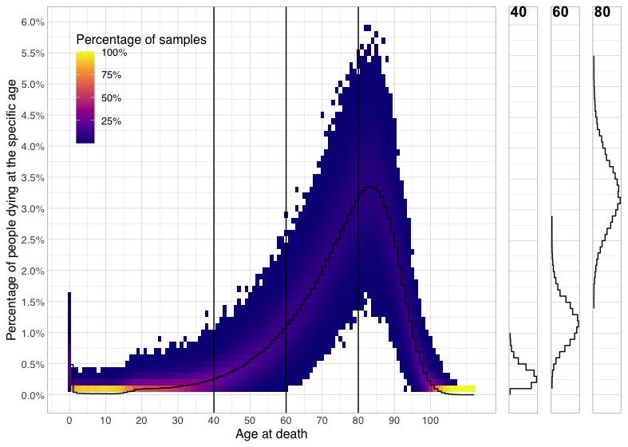

# Uncertainty in describing groups

In [this dataset](https://pxnet2.stat.fi/PXWeb/pxweb/en/StatFin/StatFin\_\_vrm\_\_kuol/statfin\_kuol\_pxt\_12ag.px/) of the age at death of the two million Finns (2 027 385 to be exact) who died between 1980 to 2020, we have a (near-)perfect record. Almost every single person who died during that timespan is listed in the dataset, and visible in the distribution below:

This means that whatever inferences we derive from this distribution are accurate. For example, over half of Finns really lived at least 77 years.

### Populations and samples

However, very often we do not have complete data on the _**population**_** **we are interested in. For example, we do not have exact data on the height of every single Finnish person, and neither do we have complete age at death data for, for example, 15th and 18th-century people. In these situations, we may however have access to a smaller _**sample**_** **of such data. If the sample is _**representative**_ of the population, its distribution will have the same general shape as the population, and we can use the sample as a proxy for the population in trying to describe it.

Turned around, very often in practice we are trying to gather a representative sample of something. To not make wrong inferences, we need to try our utmost to make the composition of our sample match the population. For example, if we wanted a 1000 person sample representing the heights of adult Finns, we could use external information we have that 50.68% of Finns are women to make the sample contain 507 women and 493 men. We might also want to sample for example people from different parts of the country in their true proportions, as well as sample from different social classes. After coming up with the sample, we'd then measure these 1000 people, and use the information derived from them to infer knowledge about Finns in general.

For historical data, what survives to us as a whole may be fixed and already _**biased**_, but we could still subsample within it to correct for these biases. On the other hand, if we in principle have access to anyone in the whole population, we can just take a completely _**random sample**_ of 1000 people, and trust that it will be representative of the population. This is what is attempted in most contemporary register and survey studies, but even they have to correct for e.g. non-response bias that usually clusters around particular groups of people.


Assignment

Consider the statement “The [British National Corpus](http://www.natcorp.ox.ac.uk) (BNC) is a 100 million word collection of samples of written and spoken language from a wide range of sources, _**designed to represent**_ a wide cross-section of British English, both spoken and written, from the late twentieth century.” (emphasis added).&#x20;

Now, consider that the composition of the BNC can be subdivided as follows:

* 90% written, 10% speech
* Written:&#x20;
  * 70-80% informative, 20-30% imaginative
  * 60% books, 30% periodicals, 10% miscellaneous
  * Informative: 5% natural and pure science, 5% applied science, 15% social and community, 15% world and current affairs, 10% commerce and finance, 10% arts, 5% belief and thought, 10% leisure
  * High, low and middle-level language
* Spoken: a demographic sample of discussions and an event-based sample of educational, business, public/institutional and leisure speech (60% dialogue, 40% monologue)

Ponder and add to the discussion on #represeativeness on Slack:&#x20;

* Would you consider the BNC a representative sample of British English?&#x20;
  * If yes, with what reservations?&#x20;
  * If no, what would you consider it a representative sample of?&#x20;
* Can there even be a representative sample of a language as a whole?


### Uncertainty remains even in perfectly sampled data

Yet, even if our sample is in general representative of the population, there is still no guarantee that its shape will exactly match the shape of the population. Instead, due to unavoidable, completely random effects in who we happen to pick and not pick, its shape can be different. Fortunately, in this situation, we know how much different it usually is.&#x20;

To dig into this, here are two different 1000 person samples taken from the age at death data, overlaid with the actual distribution (note that we've here moved from counting actual people to counting percentages. This way we can directly compare our samples against the much larger population):&#x20;

.png>)

As you can see, for some ages at death, our samples overestimate the proportion of people dying at that age, and for some ages, they underestimate the proportion. Further, at each age, one sample may well overestimate and another underestimate. Finally, it is important to note that sometimes the under/overestimation can be really large (such as here for dying at 80 years), but in general, the samples are not too far off.&#x20;

In fact,&#x20;

