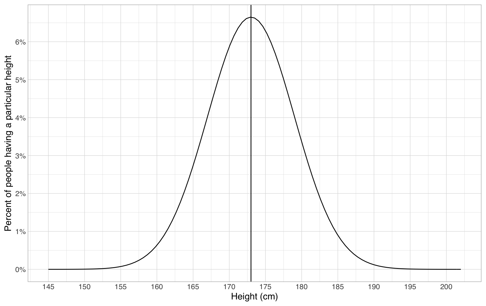
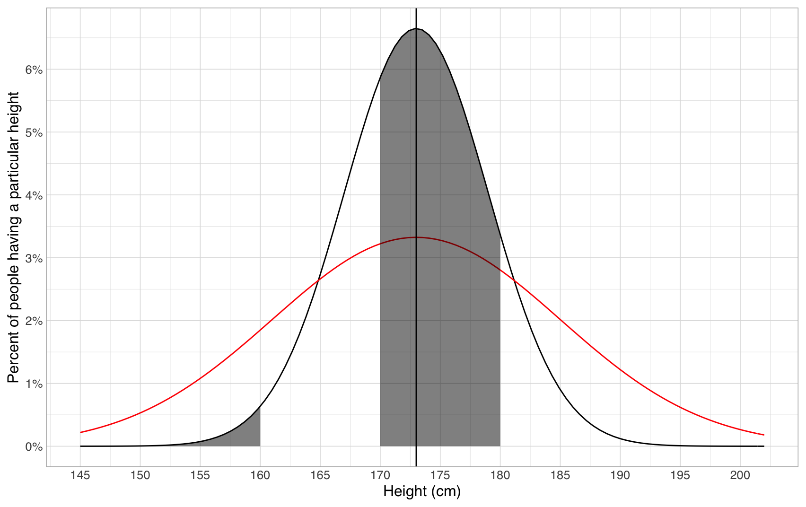
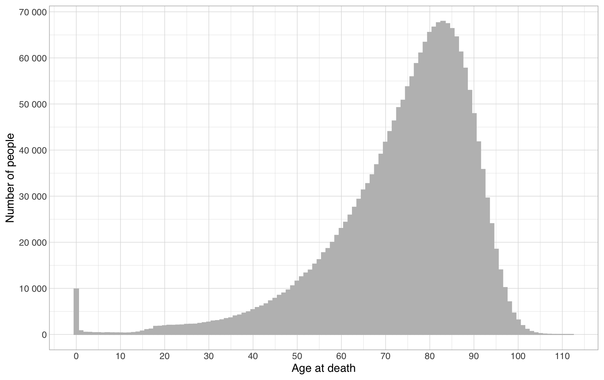
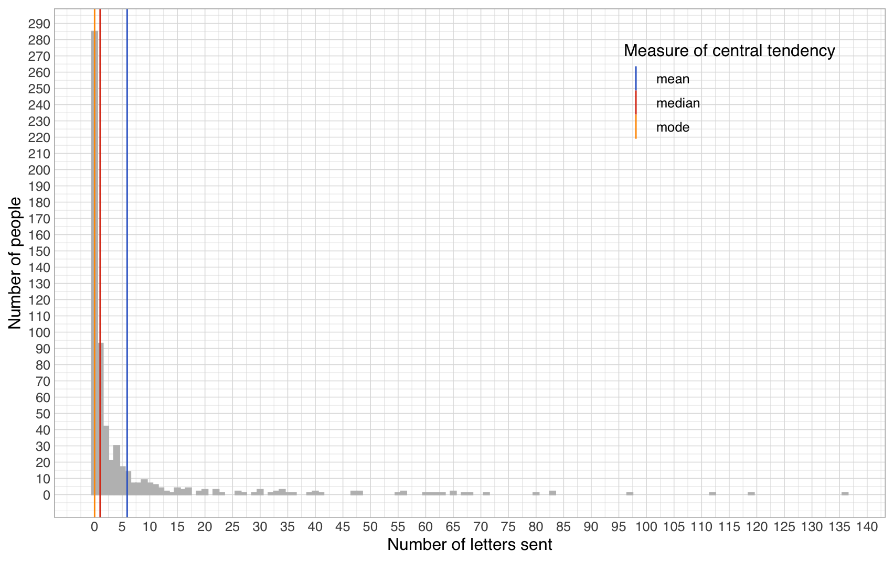

# What is average?


Assignment

Before reading on, consider for a moment what you could infer if you were told that the average height for adult Finns is 173 centimetres? Really - stop for a moment and think what could you intuitively infer from this information.


Perhaps you inferred that about half of Finns would be over 173cm tall and half under and that 173cm would itself be the most common height? You'll also have inbuilt ideation of the variance - that there will probably be quite many people 160cm or 180cm in height, but much fewer people less than 150cm or over 190cm. All of these ideations depend on the fact that [height is normally distributed](https://ourworldindata.org/human-height#height-is-normally-distributed), i.e. the distribution of heights looks something like this:&#x20;

With such data, summing it up in terms of an average value and the breadth of variation around it tells us everything we need to know about the data, and yields our intuitive understanding of what they mean in practice.&#x20;

Note that even when not often explicitly given, an understanding of the breadth of variation is still crucial to be able to draw inferences from data. For example, currently we're more than ten times likely to meet a person who is about 170-180cm in height than to meet someone who is less than 160cm. However, if there was double the amount of variation in how tall people are, we'd only be twice as likely to meet someone between 170-180cm as someone less than 160cm (compare the black and red graphs below):

.png>)

Before I wrote that usually, our intuition on averages is that the average is the most common value, as well as that 50% of values are larger and 50% smaller than the average. Now, remember again this data:

In relation to this graph, I wrote that the average age at death by natural causes seemed to be somewhere around 80 years. However, if I calculate the arithmetic mean for the whole data, it turns out to be 73,82 years. And remember, from already the original cumulative plot we deduced that half of the people die by age 77, while half live longer. Only by looking at which exact age most people died do we come close to 80, by getting 83 (67 943 people died aged 83). What does this all mean?

It means that **because our age at death data is not completely normally distributed**, there is no longer a single neat average that would sum it up nicely. Instead, we are left with multiple numbers that measure different things. Formally, these are called different measures of central tendency:

* The median of 77 tells us that 50% of people live at least to that age.
* The mode of 83 tells us that that is the most common age of death.
* The arithmetic mean of 73,82 tells us that if we removed all the variation and distributed lifetimes equally, each Finn would live 73,82 years.

When data is normally distributed, all of these measures point to the same number, yielding our intuition of what an average is. However, with non-normally distributed data, none of these measures anymore (even with a measure of variation added) sums up the whole truth of what goes on in the distribution. Below, you will find each of these measures overlaid on top of the original density plot:

Interpreted visually, the measures show the following:

* the mean shows the balance point of the distribution. If the distribution were to be hinged upon this point, it would stay level. For this distribution, this means that because there is a large mass of deaths at zero years far away from the bulk of the distribution, the mean is less than the other measures.
* the median shows the point which divides the geometric area of the distribution in half (here showing again how hard it is for people to compare areas of different shapes)
* the mode merely shows the singular point where the distribution is highest. Here this works out well, but the mode is volatile. For example, if the central mass of the distribution was much more spread out and the outlier at zero years was higher, that might end up being the mode of the whole distribution, even if the general shape of it stayed otherwise the same. Further, the mode here depends on the data having already been aggregated to a sensible level (years). If instead we'd have more precise information on the ages at death (e.g. not only years, but months, days or even seconds), we'd eventually end up in a situation where every age appeared only once, and the mode would thus end up encompassing every number in the dataset. The mean and median on the other hand would continue working just fine.

For the ages at death distribution, there is actually a large normal component - for the large subgroup of people who manage to reach adulthood and die of natural causes, their ages at death distribution is relatively normal. If the whole distribution modelled diverges farther from normal on the other hand, the measures of central tendency are even less usable. For example, below is plotted the distribution of the number of letters sent by a group of 16th and 18th-century people. The mode of the distribution is zero letters. The median is one letter, and the mean is 5.9 letters. None of these numbers is able to capture the shape of the distribution, where most people send no letters at all, but there are also 19 people who each sent more than 50 letters, the most prolific having sent a whopping 136.

In the humanities, a very large proportion of the phenomena studies are not normally distributed. Therefore, relying on any of the averages to sum up the material is often problematic. Instead, one must often drag along and analyse the entire complexity of the distribution as a whole.&#x20;

In situations where summarization cannot be avoided, the median is often a good measure to utilize. First, it always has a clear and intuitive interpretation: "half of the data is below the median, half above it". Second, the formula behind the median is extensible to other percentages. For example, to better describe the above distribution, we could state that 40% of people send zero letters, 50% of people send at most 1 letter, 70% send at most 3, 80% sent at most 5 and 90% send at most 15, while the maximum number of letters sent is 136 (i.e. 100% of people send at most 136 letters).&#x20;


Assignment

Do the practice problems relating to how altering data affects the mean and median at [Khan Academy](https://www.khanacademy.org/math/statistics-probability/summarizing-quantitative-data/more-mean-median/e/effects-of-shifting-adding-removing-data-point). If you do not yet know how to answer the questions, peruse the videos and tutorials linked there before the problems.


